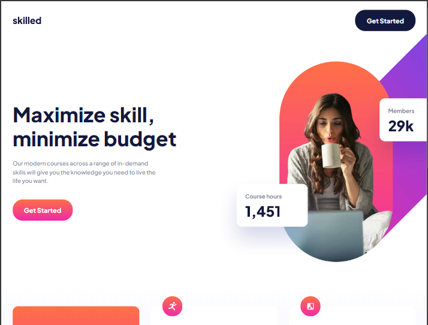
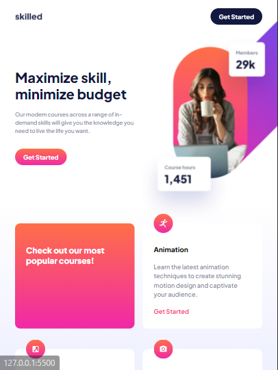
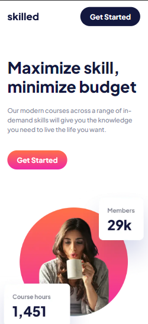

# Learning Platform Landing Page

This is a **responsive landing page** for a learning platform, developed using **HTML** and **CSS**. The page is designed to promote courses in various in-demand skills like Animation, Design, Photography, Crypto, and Business.

## 📂 Project Structure

- `index.html` - The main HTML file that structures the content.
- `/CSS/style.css` - The CSS file that handles the styling of the page.
- `/assets/` - Contains images and icons used on the page.

## 🌟 Features

- **Responsive Design**: The page is optimized for different screen sizes, with images and layout adjustments for mobile, tablet, and desktop views.
- **Modern Courses**: A dedicated section showcasing popular courses like Animation, Design, Photography, Crypto, and Business.
- **Call to Action**: Clear "Get Started" buttons encourage user engagement.

## 🖥️ Tech Stack

- **HTML**: For structuring the content of the page.
- **CSS**: For styling and responsive design.
  
## 📸 Final Output

| Desktop | Tablet | Mobile |
| ------- | ------ | ------ |
|  |  |  |
